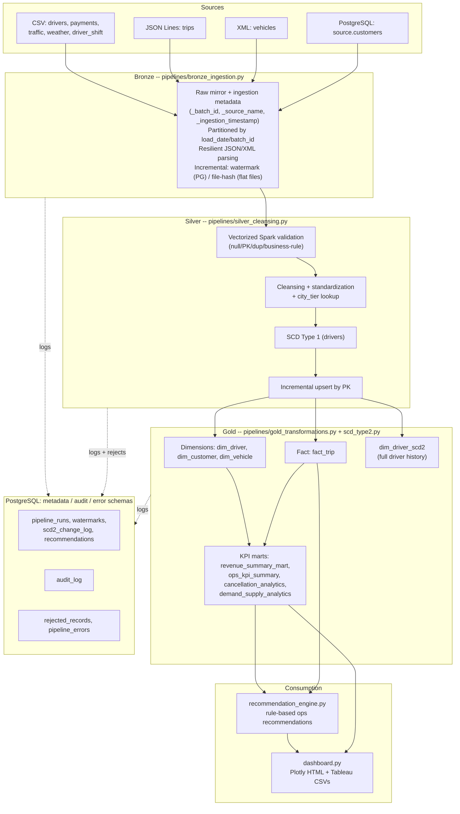
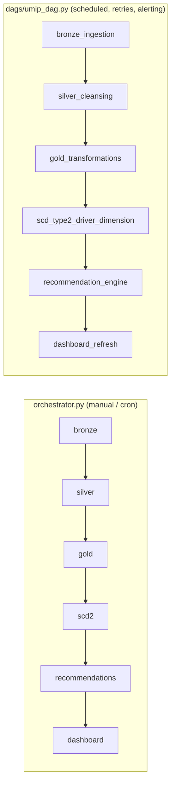

# 02. Architecture

## Medallion architecture, end to end

## Orchestration

Two equivalent ways to run the same pipeline code:

Both call the exact same pipeline modules -- Airflow's BashOperator tasks
literally run `python3 orchestrator.py --stage <name>`. There is only one
implementation of the pipeline logic; Airflow just adds scheduling,
retries, and failure alerting on top.

## Why PySpark, not plain Pandas

Bronze and Silver operate on the platform's largest tables (110k+ raw
trips, 98k+ payments) where a distributed, lazily-evaluated engine matters
for both correctness (schema enforcement, window functions for duplicate
detection) and performance (validation runs as Spark column expressions,
not a Python loop -- see `docs/17_Testing_Guide.md` for the before/after).
Gold's KPI marts and the recommendation engine / dashboard operate on much
smaller, already-aggregated tables (hundreds to low thousands of rows),
where pandas is simpler and just as fast -- using Spark there would only
add cluster startup overhead for no benefit. This project deliberately
uses each tool where it earns its complexity, not uniformly everywhere.

## Why psycopg2 + pandas instead of Spark JDBC for Postgres

`config.read_postgres_table()` pulls Postgres tables into a pandas
DataFrame, then hands that to `spark.createDataFrame()`. The "correct"
enterprise approach is `spark.read.jdbc(...)` with the PostgreSQL JDBC
driver -- but fetching that driver requires Maven Central access, which
isn't available in every environment (including the one this project was
built and tested in). The psycopg2 + pandas path works everywhere and is
fine at the platform's data volumes (thousands to tens of thousands of
rows); swap it for JDBC if you need true distributed reads from Postgres
at much larger scale.
