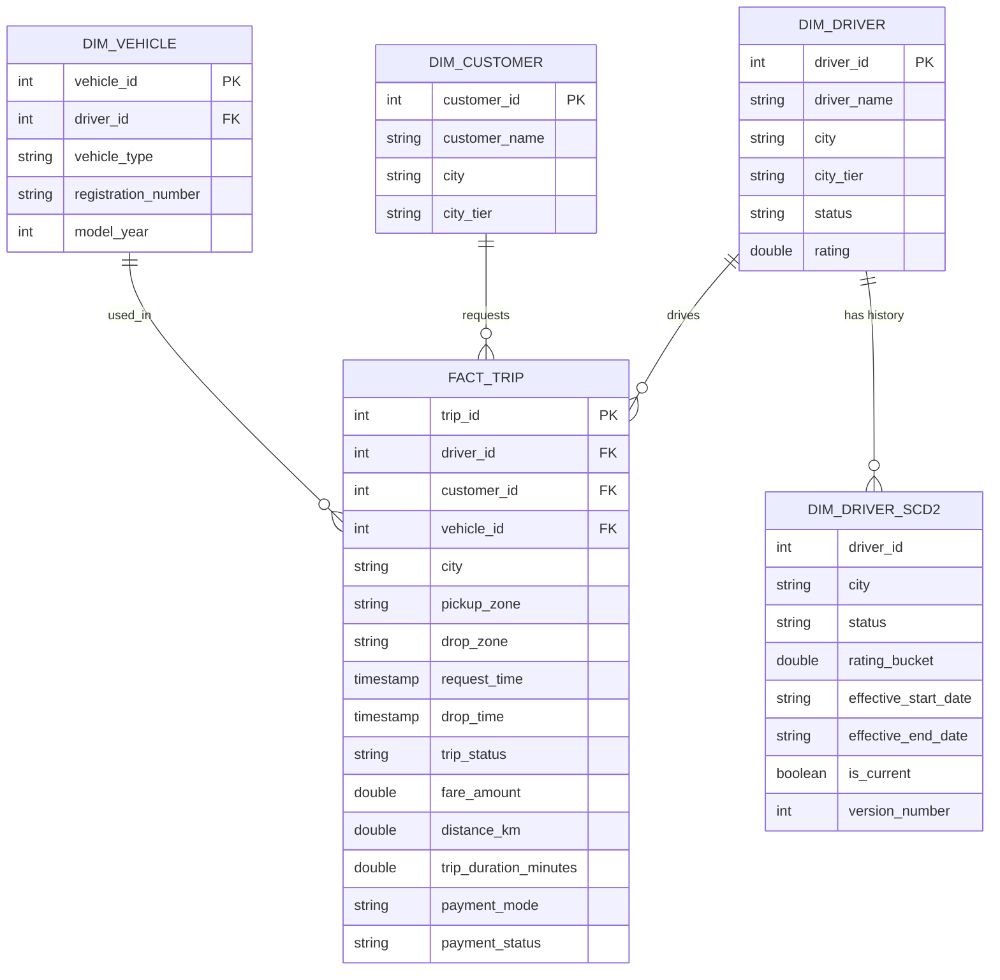

# 03. ER Diagram

## Gold layer (star schema around fact_trip)

## Postgres control-plane schema (metadata / audit / error / source)

```mermaid
erDiagram
    PIPELINE_RUNS {
        serial run_id PK
        text batch_id
        text pipeline_name
        text layer
        text entity
        timestamp execution_start
        timestamp execution_end
        int record_count
        int insert_count
        int update_count
        int reject_count
        text status
    }
    WATERMARKS {
        text entity PK
        text watermark_column
        text watermark_value
        timestamp updated_at
    }
    SCD2_CHANGE_LOG {
        serial change_id PK
        text batch_id
        int driver_id
        text changed_column
        text old_value
        text new_value
        int old_version
        int new_version
    }
    RECOMMENDATIONS {
        serial recommendation_id PK
        text batch_id
        text rule_name
        text scope_type
        text scope_value
        numeric metric_value
        text recommendation
        text severity
    }
    AUDIT_LOG {
        serial audit_id PK
        text batch_id
        text pipeline_name
        text layer
        int processed_records
        int rejected_records
    }
    REJECTED_RECORDS {
        serial reject_id PK
        text batch_id
        text entity
        text record_pk
        text failure_reason
        jsonb raw_record_json
    }
    PIPELINE_ERRORS {
        serial error_id PK
        text batch_id
        text pipeline_name
        text error_type
        text error_message
    }
    SOURCE_CUSTOMERS {
        int customer_id "no PK constraint -- see docs/17_Testing_Guide.md"
        text customer_name
        text city
        timestamp updated_at
    }
```

Note: `source.customers.customer_id` is deliberately **not** a primary
key. This table simulates an upstream OLTP export, and the platform
intentionally injects a small number of duplicate `customer_id` rows into
it so Silver's duplicate-primary-key validation rule has real data to
catch -- see `docs/17_Testing_Guide.md`.
